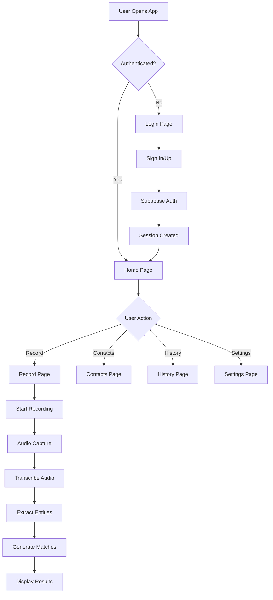
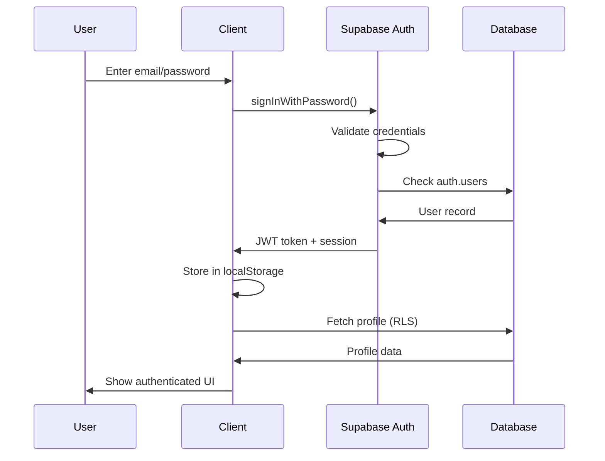
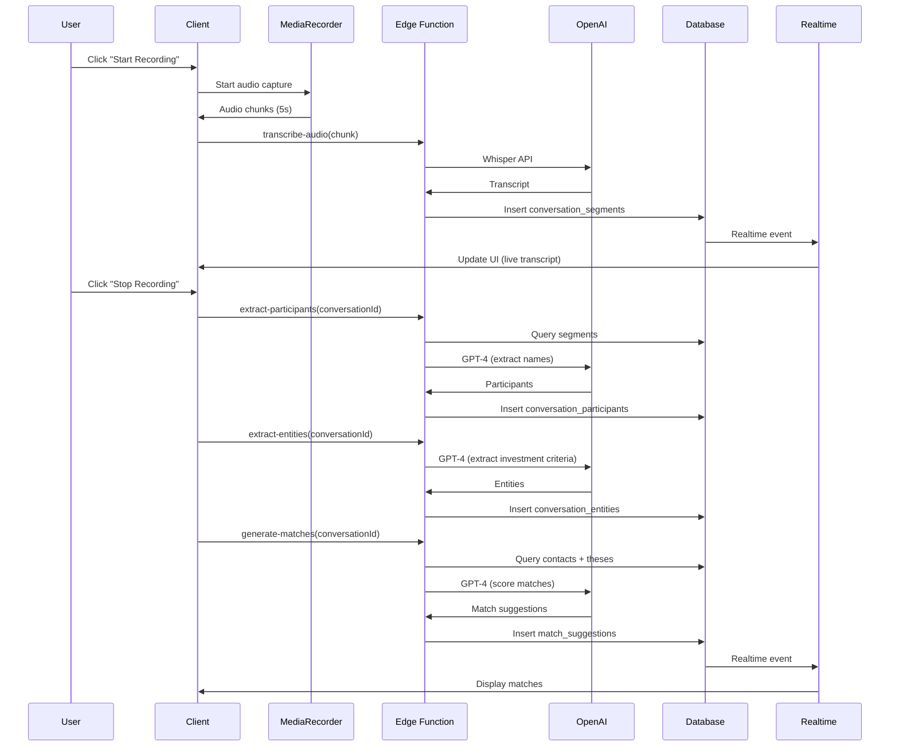
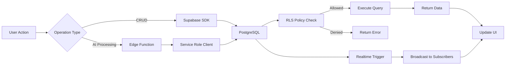
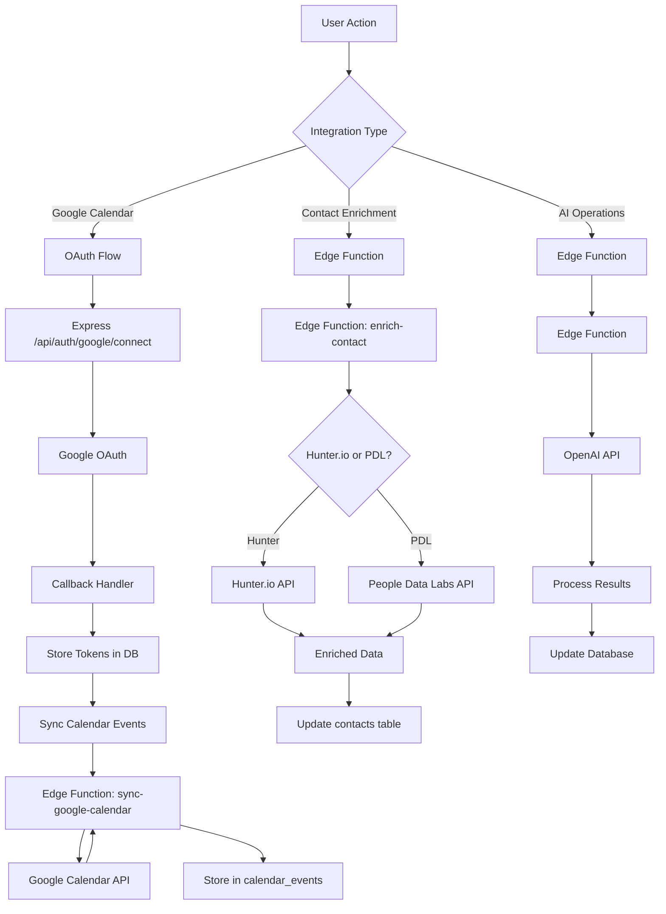
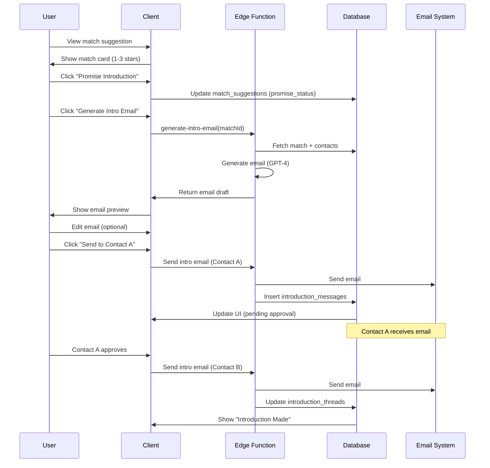
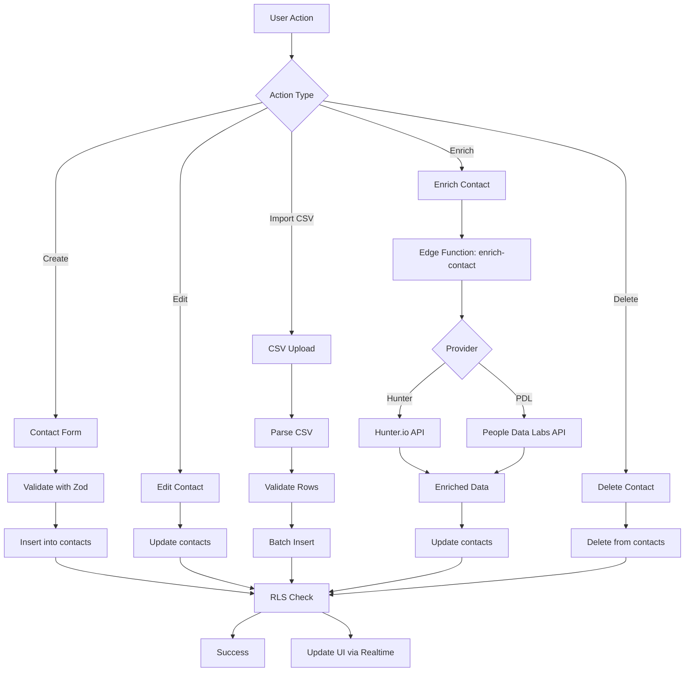
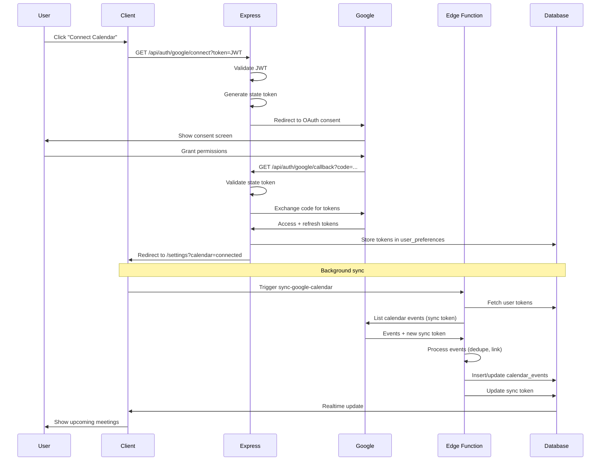
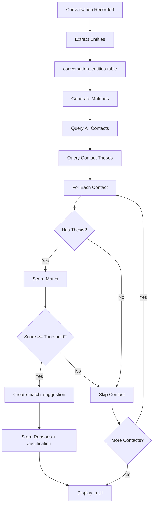
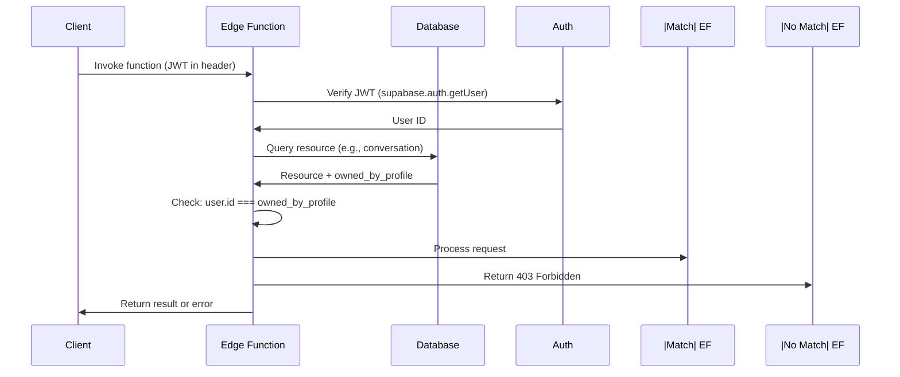

# System Flows

This document contains Mermaid diagrams for key system flows.

## Main Runtime Flow

## Authentication Flow

## Conversation Recording Flow

## Data Persistence Flow

## External Integrations Flow

## User Journey: Making an Introduction

## Contact Management Flow

## Google Calendar Sync Flow

## Match Generation Flow

## Security Flow: Ownership Validation

